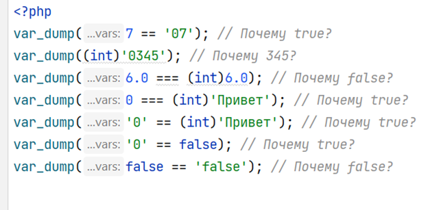

1.	Ответьте на вопросы:
      +	Для чего используется php? Какие задачи выполняет php помимо генерации html?
      +	Виден ли код php в браузере пользователя? Почему?
      +	Какие преимущества интерпретируемого языка (в частности php) перед компилируемым? Какие недостатки?
      +	Ответите на вопросы на рисунке ниже: \
 \
2.	Создайте 3 файла php: index.php, 1.php, 2.php. В файл index.php поместите приветственное сообщение в заголовке первого уровня. Текст сообщения выведите с помощью «echo». В файлах 1.php и 2.php добавьте вывод о названиях файлов в заголовках 2го уровня. Текст сообщения выводим при помощи «echo».
3.	Добавьте ссылки для перехода. В каждом файле должна быть ссылка для перехода на самого себя и на другие файлы.
4.	Создайте папку php и переместите в нее файлы 1.php и 2.php. Измените ссылки, чтобы работали переходы.
5.	В файле 2.php создайте переменную $html до начала html документа и поместите в нее любое стихотворение из предыдущего домашнего задания и выведите значение переменной в основной части html документа.
6.	В файле 1.php создайте переменную $answer и сохраните в ней вывод ответа из вопроса 1.d. Выведите значение переменной внутри тега pre.

