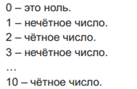

1.	Ответьте на вопросы:
      +	Что такое массив в php и для чего он используется?
      +	Что такое циклы и каково их предназначения в php?
      +	Всегда ли ключи в индексированном массиве идут в порядке возрастания? Почему?
2.	Создайте переменную $menu и сохраните в ней массив, в котором будет содержаться информация для меню сайта. При помощи функции file_get_contents прочитайте шаблон html из файла [index.html](index.html). Реализуйте вывод меню при помощи foreach из данных, сохраненных в переменной $menu.
3.	Создать массив, индексами которого являются буквы русского языка, а значениями – соответствующие латинские буквы или из сочетания (‘а’=> ’a’, ‘б’ => ‘b’, ‘в’ => ‘v’). Написать функцию транслитерации строк (замены русских символов на латинские буквы или из сочетания).
4.	С помощью цикла while вывести все числа в промежутке от 0 до 100, которые делятся на 5 без остатка.
5.	С помощью цикла for написать функцию для вывода чисел от 0 до 10, чтобы результат выглядел так:\
 \
6.	Вывести на экран таблицу умножения при помощи 2х циклов for. Использовать html теги для создания таблицы (table, tr, td)